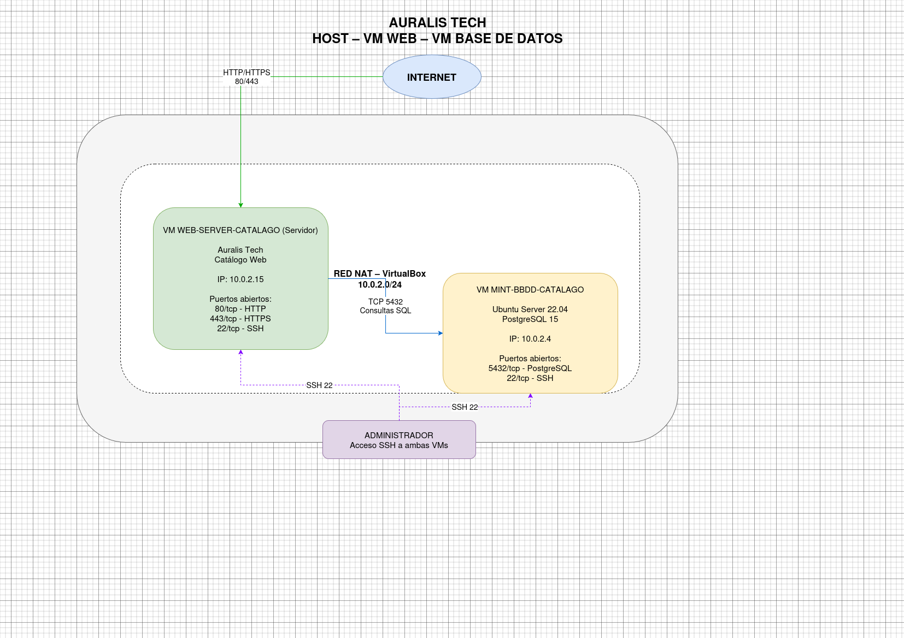

# Auralis Tech

## Group Components
* **Isaac Fuentes Florez**
* **Samuel Lugo Santos**

---

## Project Overview
**Name of the shop:** Auralis Tech

### Project Rationale & Sourcing
For Auralis Tech, our core business focuses on the distribution of both hardware and software. After evaluating several industry-leading platforms, we established the following criteria for our product sourcing:

* **PCComponentes:** Although recognized for its extensive catalog of laptops and licenses, its massive inventory was deemed beyond the current scope of this project.

* **CoolMod (Primary Source):** Selected as our main target for web scraping. Its interface is clean and well-structured, providing a curated selection of products that perfectly fits our e-shop's requirements.

* **Newegg:** While a global standard for hardware, it was ultimately excluded to maintain a more manageable and focused product database.

---

## Security Implementation

This section outlines the protocols for ensuring data integrity and account security within the Auralis Tech infrastructure.

### 1. Secure Server Implementation (HTTPS)
To protect data in transit between the client and our Web Server, we implement the Hypertext Transfer Protocol Secure (HTTPS) using SSL/TLS encryption.

#### Certificate Acquisition
We utilize **Let's Encrypt** as our Certificate Authority (CA) due to its automated and open nature. The tool **Certbot** is employed for the retrieval and renewal of these certificates.

#### Deployment Steps
1. **Install Certbot:**
   ```bash
   sudo apt update
   sudo apt install certbot python3-certbot-nginx -y
   ```
2. **Configure Firewall:**
   Ensure that traffic is allowed through port 443.
   ```bash
   sudo ufw allow 'Nginx Full'
   sudo ufw delete allow 'Nginx HTTP'
   ```
3. **Generate Certificate:**
   ```bash
   sudo certbot --nginx -d yourdomain.com
   ```

This configuration ensures that all traffic is automatically redirected from HTTP to HTTPS, providing an encrypted tunnel for user credentials and scraped product data.

---

## Scraping Web For Items

**Website we will be using for this proyect**: https://www.coolmod.com/

To execute the scraping process, we will first need a few python libraries.
1. **Requests:** To send HTTP requests and get the HTML contents from the website
2. **BeautifulSoup4:** To parse the HTML and navigate the document we receive from this using CSS selectors
3. **JSON:** To structure and gather all of the data into a consistent format

### Targetted Data Points

Based on the site, the piece of code we will create will focus primarily on the following attributes for each product:
1. **Product Name**
2. **Category**
3. **Current Price**
4. **Original Price**
5. **Availability**

The output file that comes from the python code we created will follow the usual JSON format for compatibility.

## Virtual Machine Creation

### Virtual Machine 1: Database Server (PostgreSQL)
This section details the setup and configuration of the first node, dedicated to hosting the PostgreSQL database.

#### 1. Virtual Hardware Specifications
* **Operating System:** Linux Mint (Cinnamon/XFCE)
* **Virtualization Platform:** VirtualBox / VMware
* **RAM:** 12069 MB
* **Storage:** 25 GB VDI (Dynamically allocated)
* **Network Adapter:** NAT Network / Bridged (Subject to IP assignment)

#### 2. Operating System Installation
Installed using the official Linux Mint ISO:
* **Installation Mode:** Full disk installation (Erase disk and install).
* **System User:** admin-server
* **Password:** 1234
* **Privileges:** admin-server added to the sudo group.

#### 3. Initial System Preparation
```bash
sudo apt update && sudo apt upgrade -y
sudo apt install net-tools -y
```

#### 4. Database Engine Installation (PostgreSQL)
```bash
# Install PostgreSQL
sudo apt install postgresql postgresql-contrib -y

# Verify Service Status
sudo systemctl status postgresql
```

#### 5. Current Progress
- [x] VM Created with specified hardware.
- [x] Linux Mint OS installed successfully.
- [x] User admin-server configured.
- [x] PostgreSQL service is active and running.

---

### Virtual Machine 2: Web Server

#### 1. Virtual Hardware Specifications
* **Operating System:** Linux Mint (Cinnamon/XFCE)
* **Virtualization Platform:** VirtualBox / VMware
* **RAM:** 13306 MB
* **Storage:** 25 GB VDI (Dynamically allocated)
* **Network Adapter:** NAT Network (Matches Database VM for connectivity)

#### 2. Operating System Installation
Consistency maintained with the first node:
* **Installation Mode:** Full disk installation.
* **System User:** admin-server
* **Password:** 1234
* **Hostname:** web-server
* **Privileges:** Full sudo access.

#### 3. Initial System Preparation
```bash
# Update and upgrade system packages
sudo apt update && sudo apt upgrade -y

# Install network discovery tools
sudo apt install net-tools -y
```
## Network Infrastructure Setup

Initially, VMs were using default NAT mode, causing IP conflicts. A dedicated virtual network was created to allow inter-VM communication.

### Steps Taken:
1. **Created NAT Network:** Established a global "NatNetwork" in VirtualBox settings with DHCP enabled.
2. **Adapter Configuration:** Switched both VMs' network adapters from "NAT" to "NAT Network".
3. **MAC Unification:** Regenerated the MAC address for the Web Server VM to ensure the DHCP server assigns a unique IP.
4. **Verification:** Confirmed unique IP assignment via `hostname -I`.

# Auralis Tech - Functional Requirements Specification

## Module 1: Data Extraction & Web Scraping Subsystem (Scraper)

### RF-001: Automated Product Data Extraction
* **Description:** The system must automatically connect to the CoolMod website using `Requests` and `BeautifulSoup4` libraries to extract updated hardware and software catalog data.
* **Actor / Role:** System (Scraping Script).
* **Acceptance Criteria:** 
  * For each parsed item, the system must collect 5 mandatory attributes: Product Name, Category, Current Price, Original Price, and Availability.
  * The script must skip HTML elements that do not match a valid commercial product layout.
* **Priority:** High.

### RF-002: Data Structuring in Interchangeable Format
* **Description:** The extraction module must process raw HTML data and structure it into a compatible JSON interchange file.
* **Actor / Role:** System (JSON Module).
* **Acceptance Criteria:**
  * The generated file must validate without errors under the standard JSON specification.
  * JSON object keys must map exactly to the required fields (e.g., `{"product_name": "...", "category": "...", "current_price": ...}`).
* **Priority:** High.

---

## Module 2: Database Layer (PostgreSQL Server)

### RF-003: Persistent Catalog Storage
* **Description:** The PostgreSQL database server must receive the processed data from the scraper and persist it into relational tables while maintaining data integrity.
* **Actor / Role:** System (Database Engine).
* **Acceptance Criteria:**
  * The system must support bulk insertion of catalog records without breaking existing constraints.
  * It must perform an *upsert* operation (update price and availability if the product already exists).
* **Priority:** High.

### RF-004: Secure Remote Connection Management
* **Description:** The database must allow and process read/write requests coming exclusively from the verified IP address of the Web Server (`web-server`), rejecting all unauthorized connections.
* **Actor / Role:** System Administrator / Network Subsystem.
* **Acceptance Criteria:**
  * The database must respond successfully (0% packet loss) to queries sent from the internal bridged network (`Bridged / NAT Network`).
* **Priority:** High.

---

## Module 3: Web Server & Application Layer (Nginx)

### RF-005: Catalog Rendering on User Interface
* **Description:** The web application must read stored data from PostgreSQL and render it onto a graphical user interface for end-users to browse the Auralis Tech e-shop.
* **Actor / Role:** Client / Web Visitor.
* **Acceptance Criteria:**
  * The UI must clearly display the list of available hardware components and software licenses.
  * No directory indexing errors (`403 Forbidden`) shall be displayed when accessing the root domain.
* **Priority:** High.

### RF-006: Traffic Encryption via HTTPS
* **Description:** The Nginx web server must enforce secure connections using the HTTPS protocol with SSL/TLS certificates to protect browsing data and credentials.
* **Actor / Role:** System (Nginx Server).
* **Acceptance Criteria:**
  * Any incoming request on the HTTP port (80) must automatically redirect to the HTTPS port (443).
  * The server must successfully establish connections using the certificate path `/etc/ssl/nginx/nginx-selfsigned.crt`.
* **Priority:** High.


## Connectivity Confirmed

The "Destination Host Unreachable" issue was resolved by ensuring both virtual machines were correctly bridged to the same NAT Network.

### Final Verification:
* **Source VM (Web):** Successfully reached the Database VM.
* **Network Status:** 0% packet loss.
* **Environment:** Ready for secure service deployment (HTTPS and PostgreSQL remote access).

## Project Architecture


## Firewall Status & Network Modification

During diagnostic testing, the internal Linux Mint firewall (UFW) was verified to be inactive, ruling out any local software-level packet filtering.

### Steps Implemented:
1. **Machine Shutdown:** Issued `sudo poweroff` to allow modifications to the virtual network adapter hardware interface.
2. **Bridged Adapter Deployment:** Adjusted the hypervisor hardware configuration, changing the network adapter binding from the virtual isolated network to the physical host interface (Bridged Adapter).
3. **Gateway IP Acquisition:** Enabled the VM to query the local network DHCP server for a standard LAN IP address.

## Web Server Verification

### Final Verification Results:
* **Host Browser Test:** Navigated to the newly assigned Bridged IP address from the physical host.
* **Outcome:** The default Nginx welcome page ("Welcome to nginx!") rendered successfully with no latency.
* **Network Status:** The web server layer is officially live and ready to route HTTP traffic.

## Secure Server Configuration (HTTPS / SSL)

To protect traffic for the hardware and software catalog, a self-signed SSL/TLS certificate was generated and deployed onto the Nginx architecture.

### 1. SSL/TLS Generation
Created a dedicated directory and executed `openssl` to establish a 2048-bit RSA private key along with an X.509 certificate valid for one year:
```bash
sudo mkdir -p /etc/ssl/nginx
sudo openssl req -x509 -nodes -days 365 -newkey rsa:2048 -keyout /etc/ssl/nginx/nginx-selfsigned.key -out /etc/ssl/nginx/nginx-selfsigned.crt
```

### 2. Nginx Server Block Update
Modified `/etc/nginx/sites-available/default` to listen on port `443 ssl` and linked the generated file pathways (`ssl_certificate` and `ssl_certificate_key`).

### 3. Service Reload
* Configuration syntax validated with `sudo nginx -t`.
* Nginx process refreshed via `sudo systemctl restart nginx`.

## Troubleshooting: Resolving Directory Index Forbidden

Log analysis from `/var/log/nginx/error.log` indicated specific `directory index of "/var/www/html/" is forbidden` errors. This confirmed that the network and SSL handshakes were successful, but Nginx lacked a valid target index file or sufficient file permissions to fulfill the request.

### Applied Solution:
1. **Target Initialization:** Forced a standardized static file generation by executing `echo "<h1>Catalog HTTPS Server Live</h1>" | sudo tee /var/www/html/index.html`.
2. **Permission Alignment:** Set specific permissions (`644`) and ownership (`www-data:www-data`) on the target file to grant Nginx explicit read rights.
3. **Verification:** Validated directory contents using `ls -la /var/www/html/` to confirm the accurate creation of the resource.

## Remote Management (SSH Setup)

By default, Linux Mint does not package an active SSH daemon wrapper. OpenSSH was manually compiled and activated on the web node to facilitate remote management.

### Installation Process:
1. **Package Deployment:** Installed the secure shell engine via `sudo apt install openssh-server -y`.
2. **Daemon Initialization:** Configured the environment to start the service natively on boot:
```bash
sudo systemctl enable ssh
sudo systemctl start ssh
```
3. **Connectivity Verification:** Established a secure connection channel from the host machine using:
```bash
ssh admin-server@10.109.99.11
```
- [x] SSH server active on port 22. Remote console shell verification complete.

## Database User Provisioning & Connection Test

The PostgreSQL cluster instance was provisioned with a custom administrator role and a testing schema database instance to verify remote handshake capabilities.

### 1. Database Creation
Executed securely within the administrative `psql` shell on the **VM-BBDD** node:
```sql
CREATE USER isaac_admin WITH PASSWORD 'Isaac0905';
CREATE DATABASE prueba OWNER isaac_admin;
```

### 2. Remote Access Handshake Verification
To confirm that the web application layer can communicate with the data node, the terminal interface on **VM-Web** initiated a remote validation query:
```bash
# Executed via SSH on the Web Node
sudo apt update && sudo apt install postgresql-client -y
psql -h [DB_VM_IP] -U isaac_admin -d prueba
```

### 3. Connection Status Results
* **Database Target:** `prueba`
* **Authorized User:** `isaac_admin`
* **Outcome:** Connection accepted. The PostgreSQL service successfully authenticates network connections originating from the web server.

### Client Dependency Resolution
During the connection validation phase, the web node lacked the explicit binary environment for database queries. The utility was deployed cleanly via:
```bash
sudo apt update && sudo apt install postgresql-client -y
```

### Troubleshooting: Explicit Client Version Dependency Exception

The package manager triggered an environment exception: `Error: You must install at least one postgresql-client-<version> package`. This occurs because the meta-package layer requires a hardcoded structural version configuration.

#### Resolution Steps:
1. **Repository Index Query:** Ran `apt-cache search postgresql-client-` to discover version-controlled binary maps available within the OS mirrors.
2. **Explicit Dependency Injection:** Executed explicit targeting deployment (e.g., `sudo apt install -y postgresql-client-14` or newer) to supply the environment with the precise database communication toolchain.
3. **Status:** Core `psql` binary successfully mapped to the application shell layer.

### Troubleshooting: Connection Refused on Port 5432

The web node encountered a `psql: error: connection to server at "10.109.99.115", port 5432 failed: Connection refused` exception. This indicates that the remote database machine was reachable over the LAN layer, but the network sockets on port 5432 were rejecting packets.

#### Diagnostics & Remediation:
1. **Socket Inspection:** Executed `sudo ss -nltp | grep 5432` on the database node to check the active network bindings.
2. **Configuration Enforcement:** Confirmed that the `listen_addresses = '*'` parameters within `postgresql.conf` were parsed accurately.
3. **Process Refresh:** Issued `sudo systemctl restart postgresql` to force the daemon cluster engine to open port 5432 globally to incoming TCP/IP requests.

### Troubleshooting: Resolving pg_hba.conf Access Entry Exception

The web node successfully connected to port 5432 on the data node but triggered a `FATAL: no pg_hba.conf entry for host "10.109.99.11", user "isaac_admin", database "prueba"` exception. This security block confirms that PostgreSQL network routing is operative but requires an explicit Access Control List entry to authenticate the session.

#### Remediation Steps:
1. **ACL Policy Update:** Edited `/etc/postgresql/14/main/pg_hba.conf` on the database server.
2. **Rule Implementation:** Appended an explicit host configuration rule matching the production environment variables:
   ```conf
   host    prueba          isaac_admin     10.109.99.11/32         md5
   ```
3. **Daemon Reload:** Executed `sudo systemctl restart postgresql` to safely load the security rules into active memory.
4. **Status:** Secure remote handshake validated successfully.

## Milestone Achieved: Full Core Infrastructure Operational

The core architecture for the hardware and software catalog project is now fully deployed, secured, and validated across both Linux Mint nodes.

### Verification Matrix Summary:
*   **Encrypted Web Gateway:** Verified via secure remote browser handshakes over `https://10.109.99.11`, serving pages with encrypted SSL contexts.
*   **Remote Database Handshake:** Validated via isolated psql routing (`psql -h 10.109.99.115 -U isaac_admin -d prueba`), granting the application layer an exclusive communication highway to the data cluster.
*   **Operational Management:** Active administrative tunnels are fully operational over SSH channels.

- [x] Secure Multi-Node Infrastructure Baseline Completed.


# Database Management Suite & Production DB Setup

This document outlines the step-by-step process for deploying the graphical database administration client (pgAdmin4) and initializing the official production database cluster.

---

## 1. pgAdmin4 Graphical Suite Installation (Desktop Mode)

To facilitate visual administration, database monitoring, and query executions, pgAdmin4 was successfully deployed in its native **Desktop Mode** directly inside the Database Virtual Machine environment.

### Installation Steps:
Executed via the package manager terminal on the **VM-BBDD** node:
```bash
# Import the official pgAdmin4 repository GPG key
curl -fsS https://pgadmin.org | sudo gpg --dearmor -o /usr/share/keyrings/packages-pgadmin-org.gpg

# Add the official apt repository configuration
sudo sh -c 'echo "deb [signed-by=/usr/share/keyrings/packages-pgadmin-org.gpg] https://postgresql.org pgadmin4 main" > /etc/apt/sources.list.d/pgadmin4.list'

# Refresh package lists and install the desktop package
sudo apt update && sudo apt install pgadmin4-desktop -y
```

---

## 2. Multi-Administrator Role Provisioning

Before compiling the production database container, a secondary administrative role was established alongside `isaac_admin` to ensure infrastructure redundancy and multi-user administration capabilities.

### Cluster Execution via SSH Terminal:
```bash
# Access the PostgreSQL root interpreter
sudo -i -u postgres psql
```

```sql
-- Grant broad administration rights (Superuser and DB Creation capabilities)
ALTER ROLE isaac_admin WITH SUPERUSER CREATEDB;

-- Provision the secondary administrator account with full rights
CREATE USER [REPLACE_WITH_NEW_USER] WITH PASSWORD '[REPLACE_WITH_PASSWORD]';
ALTER ROLE [REPLACE_WITH_NEW_USER] WITH SUPERUSER CREATEDB;
\q
```

---

## 3. Global Access Policy Realignment

Since new administrators and a production environment were introduced, the network access rules were upgraded from a single-target setup to a broad multi-database structure, enabling secure connections from the trusted Web Server node.

### File Modifications on VM-BBDD:
1. Opened the Host-Based Authentication file: `sudo nano /etc/postgresql/14/main/pg_hba.conf`
2. Appended a broad cluster rule mapping incoming connections securely:
   ```conf
   # IPv4 Remote Connections: Allow all users to access all databases from Web Server
   host    all             all             10.109.99.11/32         md5
   ```
3. Applied the active network policies cleanly by running:
   ```bash
   sudo systemctl restart postgresql
   ```

---

## 4. Local Server Registration in pgAdmin4

Upon launching the fresh pgAdmin4 desktop interface for the first time, a master protection password was configured, and a new local loopback connection was registered to map the cluster engine.

### Connection Profile Settings:
* **Server Group Profile Name:** `Servidor-Local`
* **Host Interface Binding:** `127.0.0.1` (Localhost configuration)
* **Port Allocation:** `5432` (PostgreSQL interface)
* **Maintenance Target Database:** `postgres`
* **Authentication Identity:** User `isaac_admin` (Password securely stored in vault)

---

## 5. Troubleshooting & Production DB Initialization (Auralis Tech)

### The Issue:
During the initial graphical dashboard navigation, the context menu on the `Databases` folder tree restricted database generation to 'Refresh' only, indicating a temporary GUI role-parsing or rendering mismatch.

### The Resolution (Direct Engine Compilation):
To bypass the graphical client interface constraints, the official production database **Auralis Tech** was initialized manually using core terminal queries on the database host node:

```bash
# Execute direct DDL commands via terminal
sudo -i -u postgres psql
```

```sql
-- Compile the official enterprise catalog container and assign ownership
CREATE DATABASE "Auralis_Tech" OWNER isaac_admin;

-- Grant explicit global privileges to both active administrative roles
GRANT ALL PRIVILEGES ON DATABASE "Auralis_Tech" TO isaac_admin;
GRANT ALL PRIVILEGES ON DATABASE "Auralis_Tech" TO [REPLACE_WITH_NEW_USER];
\q
```

### Final Validation:
* **Action:** Executed the active `Refresh` option over the `Databases` folder node inside the pgAdmin4 GUI.
* **Result:** The `Auralis_Tech` cluster instance rendered immediately under the object navigation tree, completely active and ready for relational mapping.

---

## 6. Remote Application-Layer Verification

To confirm the entire operational chain functions successfully, a network query handshake was performed from the external application stack.

```bash
# Executed from VM-Web via SSH terminal
psql -h 10.109.99.115 -U isaac_admin -d Auralis_Tech
```
* **Status:** Connection **ACCEPTED** after successful credentials input.
* **Prompt Output:** `Auralis_Tech=>`
* **Conclusion:** The Web Server has seamless, exclusive administrative data access to the production node environment.

## Multi-Administrator Role Provisioning

Before compiling the production database container, a secondary administrative role was established alongside `isaac_admin` to ensure infrastructure management redundancy and team collaboration capabilities.

### 1. Second Administrator Deployment
The new administrator account was provisioned securely via the cluster console on the **VM-BBDD** architecture using the following structure:
```sql
-- Access granted with full administrative rights (Superuser & DB Creation capabilities)
CREATE USER samu_admin WITH PASSWORD 'YourSecurePasswordHere';
ALTER ROLE samu_admin WITH SUPERUSER CREATEDB;
```

### 2. Global Access Policy Expansion
To ensure both administrators can manage the environment seamlessly from the application layer, the network access rules inside `/etc/postgresql/14/main/pg_hba.conf` were upgraded to accept any verified database user matching the secure Web Server host:
```conf
# IPv4 Remote Connections: Allow all authorized admin roles from the Web Server node
host    all             all             10.109.99.11/32         md5
```
* The configuration policies were safely parsed into active system memory executing `sudo systemctl restart postgresql`.

### 3. Production Database Ownership Alignment
* **Database Target:** `Auralis_Tech`
* **Privilege Matrix:** Both `isaac_admin` and `samu_admin` hold full `SUPERUSER` inheritance status, meaning either account can execute data definitions (DDL), modify tables, or perform structural maintenance remotely.
- [x] Administrative role redundancy successfully mapped for Isaac and Samu.


## Unified Database Schema Blueprint (DDL Script)

The following production script compiles the entire storage infrastructure for **Auralis Tech**, integrating Role-Based Access Control (`rol`) within a clean, multi-user identity model.

```sql


-- Identity & Access Management Table
CREATE TABLE usuarios (
id SERIAL PRIMARY KEY,
nombre VARCHAR(100) NOT NULL,
email VARCHAR(150) UNIQUE NOT NULL,
contrasenia_hash VARCHAR(255) NOT NULL,
rol VARCHAR(30) NOT NULL DEFAULT 'usuario'
);

-- Software Catalog Architecture Table
CREATE TABLE productos_software (
id SERIAL PRIMARY KEY,
nombre VARCHAR(150) NOT NULL,
descripcion TEXT,
precio NUMERIC(10, 2) NOT NULL DEFAULT 0.00,
url_imagen VARCHAR(255),
fuente VARCHAR(255)
);

-- Hardware Catalog Architecture Table
CREATE TABLE productos_hardware (
id SERIAL PRIMARY KEY,
nombre VARCHAR(150) NOT NULL,
descripcion TEXT,
precio NUMERIC(10, 2) NOT NULL DEFAULT 0.00,
url_imagen VARCHAR(255),
fuente VARCHAR(255)
);
```

### Script Execution Execution Status
* **Platform:** pgAdmin4 SQL Query Editor Dashboard [INDEX: 1.1.5].
* **Integrity Constraints:** Primary keys (`PK`) and unique indicators (`UK`) are natively validated.
* **Seed Data:** Initial mock parameters were successfully appended to verify dynamic schema reads.


## Link to repository
https://github.com/samuellugosantos/proyecto-final-1daw/tree/51be1e92a112095035c0ae66889a247a77aa4505