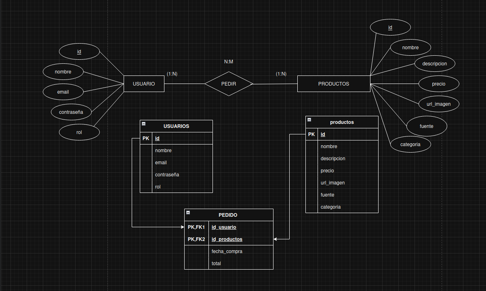

# Auralis Tech

## Group Components
* **Isaac Fuentes Florez**
* **Samuel Lugo Santos**
* **Javier Jacinto Martín**

---

## Project Overview
**Name of the shop:** Auralis Tech

### Project Rationale & Sourcing
For Auralis Tech, our core business focuses on the distribution of both hardware and software. After evaluating several industry-leading platforms, we established the following criteria for our product sourcing:

* **PCComponentes:** Although recognized for its extensive catalog of laptops and licenses, its massive inventory was deemed beyond the current scope of this project.

* **CoolMod (Primary Source):** Selected as our main target for web scraping. Its interface is clean and well-structured, providing a curated selection of products that perfectly fits our e-shop's requirements.

* **Newegg:** While a global standard for hardware, it was ultimately excluded to maintain a more manageable and focused product database.

---

## Project Architecture

---

### Relational Model

---

## Link to repository
https://github.com/samuellugosantos/proyecto-final-1daw/tree/51be1e92a112095035c0ae66889a247a77aa4505